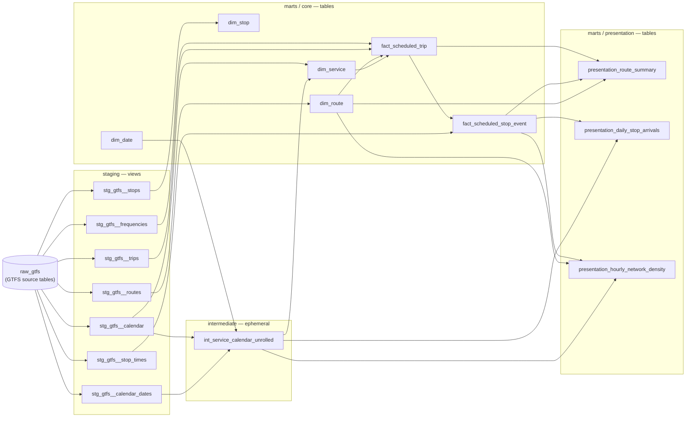

# Data model — how the data flows

A single map of the dbt project: what each layer is for, what every model does, and
how one real trip flows from the raw GTFS feed all the way to the presentation tables.
If you only read one doc to understand the warehouse, read this one.

All row counts below are from the **2026-04-30 GTFS snapshot** (the zip Transjakarta
emailed, loaded 2026-05-21). They're verified against the live `dbt_dev_jason_*` tables,
not estimated.

---

## The layers in one line each

- **raw** (`raw_gtfs.*`) — exact copies of the GTFS source files. Untouched. Job: fidelity.
- **staging** (`stg_gtfs__*`, views) — the same data, cleaned: renamed, typed, light fixes. One staging model per source file, same grain. Job: a stable seam that absorbs source changes.
- **intermediate** (`int_*`, ephemeral) — reusable business logic shared by several downstream models. Job: don't repeat yourself. We have exactly **one**, and it earns its place (see below).
- **marts / core** (`dim_*`, `fact_*`, tables) — the star schema: conformed dimensions and facts. Job: the trustworthy analytical core.
- **marts / presentation** (`presentation_*`, tables) — wide, denormalized, ready-to-chart tables. Job: convenience for dashboards/analysts.

Mental shortcut: **raw = faithful · staging = clean · intermediate = reusable logic · marts = the finished thing you hand someone.**

---

## Lineage diagram

> Your published dbt docs site has an auto-generated version of this graph too, but it
> also draws every test node, which makes it noisy. This hand-drawn one shows just the
> models and the real dependencies.

---

## Every model at a glance

| Model | Layer | Grain (one row per…) | Rows | What it does |
|---|---|---|---|---|
| `stg_gtfs__calendar` | staging | service_id | 7 | Clean/type the weekly service patterns |
| `stg_gtfs__calendar_dates` | staging | (service_id, date) | 0 | Holiday exceptions (empty this snapshot) |
| `stg_gtfs__frequencies` | staging | (trip_id, window) | 772 | Headway windows, times → seconds |
| `stg_gtfs__routes` | staging | route_id | 253 | Clean route attributes |
| `stg_gtfs__stop_times` | staging | (trip_id, stop_sequence) | 26,582 | Stop-by-stop schedule template |
| `stg_gtfs__stops` | staging | stop_id | 8,216 | Clean stop attributes |
| `stg_gtfs__trips` | staging | trip_id | 717 | Clean trip attributes |
| `int_service_calendar_unrolled` | intermediate | (service_id, service_date) | ephemeral | Unroll calendar into active dates + apply exceptions |
| `dim_date` | core | date | 4,018 | Date spine 2020→2030 |
| `dim_route` | core | route_id | 253 | Route dim + `service_category` (BRT/Mikrotrans/…) |
| `dim_stop` | core | stop_id | 8,216 | Stop dim + `is_station` flag |
| `dim_service` | core | service_id | 7 | Service dim + friendly name + active-days count |
| `fact_scheduled_trip` | core | (trip_id, realized departure) | 70,322 | Every abstract scheduled departure (dates NOT yet expanded) |
| `fact_scheduled_stop_event` | core | (scheduled_trip, stop_sequence) | 2,984,706 | **Apex fact** — every scheduled stop visit |
| `presentation_route_summary` | presentation | route_id | 253 | Per-route KPIs (headway, departures, stops) |
| `presentation_daily_stop_arrivals` | presentation | (service_date, stop_id) | 23,097,039 | Arrivals per stop per clock-date |
| `presentation_hourly_network_density` | presentation | (service_date, hour, category) | 480,061 | Network arrivals by hour of day |

---

## Worked example: following L13E through the pipeline

`L13E` is the **Puri Beta – Flyover Kuningan (Express)** BRT route (route_id `L13E`):
5 trip patterns, ~839 departures/day, 25 stops, ~6.1-min average headway, ~17h service
window. Here's how one of its departures comes to exist as data.

1. **raw → staging.** The feed has a `frequencies` row for an L13E trip like *"runs every
   ~366 seconds from 05:00 to 22:00."* `stg_gtfs__frequencies` keeps that one row but
   converts the clock times to seconds-from-service-midnight.

2. **frequency expansion (inside `fact_scheduled_trip`).** That single "every ~6 min"
   window is expanded with `GENERATE_ARRAY` into one row per actual departure: 05:00,
   05:06, 05:12, … This is why L13E has ~839 rows a day instead of a handful of windows.
   Joining `stg_gtfs__trips`, `dim_route`, and `dim_service` denormalizes in the route
   name, service category, and service calendar. Grain: (trip_id, departure time).

3. **stop expansion (inside `fact_scheduled_stop_event`).** Each L13E departure is crossed
   with its trip's stop template from `stg_gtfs__stop_times`. The template stores each stop's
   **offset** from the trip's first stop (for trip L13E-R03: stop 0 = +0s, stop 1 = +133s,
   stop 2 = +865s, …). Add the offset to the realized departure and you get the realized
   arrival at every stop. One departure becomes as many rows as that trip has stops (L13E's
   five patterns range from 6 to 25 stops). Grain: (scheduled_trip, stop_sequence).

4. **presentation.** `presentation_route_summary` rolls all of L13E's rows back up into the
   one-line KPIs above; the daily/hourly tables expand across real service dates (using
   `int_service_calendar_unrolled`) for dashboards.

So L13E's 5 frequency windows → 839 departures → 10,421 stop events, then roll back up
to 1 summary row.

---

## Three things that confuse people (on purpose)

**Why two facts instead of one?** `fact_scheduled_trip` is "every departure" (70k rows);
`fact_scheduled_stop_event` is "every stop visit" (3M rows). Splitting them keeps the
expensive 3M-row explosion in one place and lets trip-level questions ("how many
departures?") run against the small table. Different grains, different jobs.

**Why only one intermediate, and why is it invisible in BigQuery?** Intermediate models
exist for two reasons: *reuse* (logic needed by several models) and *readability*
(isolating a gnarly step). `int_service_calendar_unrolled` is the reuse case — its
calendar-unrolling logic feeds `dim_service` and both date-expanding presentation tables,
so it lives once instead of being copy-pasted three times. It's **ephemeral**, meaning
dbt pastes its SQL inline as a CTE into whoever uses it rather than building a table —
that's why you won't find it as an object in BigQuery. (The project used to have two more
intermediates, but each had a single consumer, so they were inlined directly into their
facts.)

**Why do hours like 24 and 25 appear?** Times are stored as
`*_seconds_from_service_midnight`. A bus that leaves at 23:50 and arrives downstream at
00:15 the next calendar day is kept as 24:15 (= 87,300s) because it still belongs to the
*previous service day*. The core facts preserve this on purpose (schedule fidelity); the
`presentation_*` tables shift those rows onto the correct clock date for dashboards.

---

## Left for later (consolidation candidates, not yet done)

These were deliberately **not** changed — they'd reduce model count but carry more risk,
and the current goal was understandability. Noted here so the option exists:

- **Two-fact split** — could be collapsed if you only ever query at stop-event grain, but
  you'd lose the cheap trip-level table. Keep unless it proves redundant.
- **Three presentation tables** — check whether all three are actually consumed by a
  dashboard before keeping all of them; unused ones are just storage + build time.
